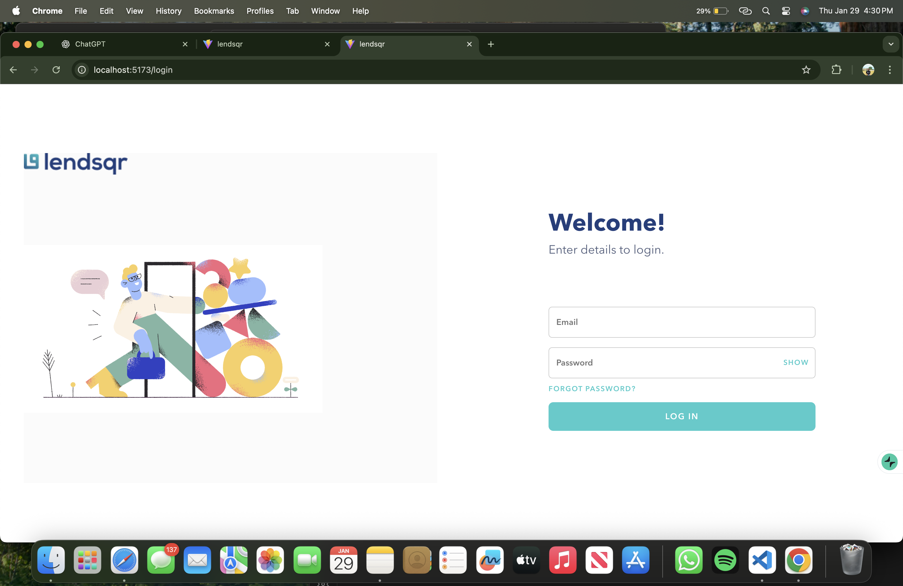
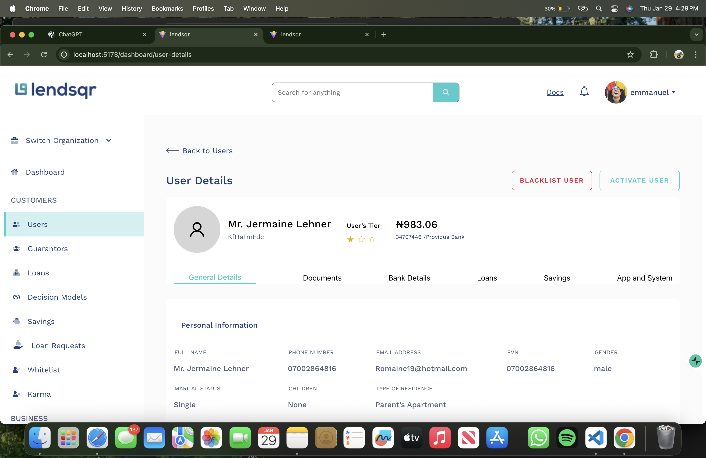

# 📊 Lendsqr Admin Dashboard

A modern, fully responsive **Admin Dashboard** built with **React**, **TypeScript**, and **CSS Grid**.
Designed for scalability, clean UI, and smooth user experience across desktop and mobile devices.

---

## 🚀 Features

* 📐 **CSS Grid–based layout**
* 📱 **Fully responsive design**
* 📂 **Collapsible sidebar navigation**
* 🍔 **Mobile-friendly hamburger menu**
* 🔐 **Protected routes (authentication-ready)**
* 🧭 **Nested routing with React Router**
* 🎨 Clean & minimal UI
* ⚡ Fast and lightweight

---

## 🛠️ Tech Stack

* **React**
* **TypeScript**
* **React Router v6**
* **CSS Grid & Flexbox**
* **LocalStorage authentication (demo-ready)**

---

## 📁 Project Structure

```bash
src/
├── components/
│   ├── Header.tsx
│   ├── SideBar.tsx
|  |--- DataTable.tsx
├── dashboard/
│   ├── Dashboard.tsx
│   ├── Home.tsx
│   ├── UserDetails.tsx
├── hooks/
│   └── Auth_hooks.ts
|  |__ DataHooks.ts
├── routes/
│   └── ProtectedRoute.tsx
├── css/
│   └── dashboard.css
├── App.tsx
└── main.tsx
```

---

## 🧱 Dashboard Layout (CSS Grid)

```txt
+------------------+----------------------+
|             Header       
|------------------+----------------------+
|       Sidebar    |  Main Content        |
+------------------+----------------------+
```

* Sidebar collapses on mobile
* Main content scrolls independently
* Header stays fixed

---

## 🔐 Authentication Flow

* Login state stored in `localStorage`
* Protected routes prevent unauthorized access
* Auto redirect:

  * `/login` → `/dashboard` if authenticated
  * `/dashboard` → `/login` if not authenticated

---

## 🧪 Getting Started

### 1️⃣ Clone the repository

```bash
git clone https://github.com/Douglasemmanuel/LENDSQR-WEB-APP-.git
cd lendsqr
```

### 2️⃣ Install dependencies

```bash
npm install
```

### 3️⃣ Start the development server

```bash
npm run dev
```

---

## 📱 Responsive Behavior

* **Desktop**: Sidebar + content layout
* **Tablet**: Collapsible sidebar
* **Mobile**: Slide-in sidebar overlay

---
* **Login Screen**


* **Dashboard Screen**


* **UserDetails Screen**


---


🎥 Video Demo
▶️ Full Dashboard Walkthrough

🔗 Direct Link:
https://www.youtube.com/watch?v=YOUR_VIDEO_ID

---

🌐 Live Demo

👉 Live App:
https://lendsqr-web-fi7oukj33-douglasemmanuels-projects.vercel.app/

---

## 📄 License

This project is licensed under the **MIT License**.

---

## ⭐ Support

If you like this project, give it a ⭐ on GitHub — it really helps!

---

